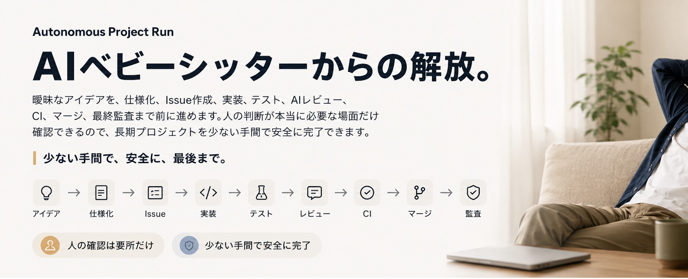

# Autonomous Project Run



曖昧な目標から始まる複数IssueのGitHubプロジェクトを、少ない監督で検証済みの完了状態まで進めるスキルです。

`autonomous-project-run` は、仕様化、依存関係付きチケット、作業を分離した実装、テスト、AIレビュー、CI、Pull Request、マージ、Issueの完了確認、最終監査までをまとめて進行します。

> 状態：pre-stable（`0.2.0`）。セキュリティとreleaseのgateは本リポジトリに記載しています。

[English](README.md)

## できること

- 計画や実装の途中からでも、最初に残っている工程を見つけて再開します。
- 方向性、範囲、取り消せない操作に関わる重要な判断だけを人に確認します。
- 1つの実装チケットを1つの新しいtaskで扱い、検証してから次へ進みます。
- production変更、credentials、支払い、破壊的操作など、明示された安全境界で停止します。
- 全チケットを横断して監査し、本当に完了しているか確認します。

## 必要なもの

- Agent Skillsに対応したcoding agent
- 全工程を使う場合は、GitHubリポジトリと認証済みの `gh` CLI
- Matt Pocock氏のworkflow skill suite（`setup-matt-pocock-skills`、`wayfinder`、`to-spec`、`to-tickets`、`implement` を含む）
- 無人で複数Issueを進める場合は、新しいtask/threadの作成、分離されたworktree、定期heartbeatの仕組み
- Codexのレビューゲートを使う場合は `codex-autoreview`

先に元となるworkflow skillsをインストールします。

```sh
npx skills@latest add mattpocock/skills
```

表示された選択肢からworkflow suiteを選びます。関連するcompanion skillsには `grilling`、`domain-modeling`、`research`、`prototype`、`tdd`、`code-review` があります。対象リポジトリごとに `/setup-matt-pocock-skills` を一度実行し、続いて本スキルをインストールします。

```sh
npx skills@latest add AkiGarage/autonomous-project-run
```

入手元には公式の [`mattpocock/skills`](https://github.com/mattpocock/skills) を使ってください。管理された環境では、hostがdependency lockに対応している場合、確認済みの互換revisionに固定します。新しいtask、分離worktree、heartbeat automationが使えない場合は、無人実行ではなく、人が確認しながら手動で継続するworkflowとして利用してください。

## 使い方

対象リポジトリと達成したい結果を指定して呼び出します。

```text
$autonomous-project-run を使って、このプロジェクトを少ない確認だけで完了まで進めてください。
```

ブランチ作成、テスト、レビュー、commit、Pull Request、マージなど、通常のリポジトリ作業は自律実行の対象です。一方、Public公開、支払い、credentialsへのアクセス、production変更、破壊的な整理、force-push、保護ルールの回避は許可されません。

## リポジトリ構成

```text
skills/autonomous-project-run/
├── SKILL.md
└── agents/openai.yaml
```

## 出典とライセンス

本プロジェクトは、Wayfinderを含む [Matt Pocock's Skills for Real Engineers](https://github.com/mattpocock/skills) のworkflow conceptsを組み合わせ、拡張しています。元プロジェクトはMIT Licenseで公開されています。Wayfinderと組み合わせ可能なworkflow設計を公開したMatt Pocock氏に感謝します。

本リポジトリは独立して管理されており、Matt Pocock氏との提携や同氏による推奨を示すものではありません。[LICENSE](LICENSE) と [THIRD_PARTY_NOTICES.md](THIRD_PARTY_NOTICES.md) を参照してください。

## コントリビューションとセキュリティ

検証方法とPull Requestの方針は [CONTRIBUTING.md](CONTRIBUTING.md) を参照してください。公開Issueに脆弱性の詳細を書かず、非公開報告または詳細を含めない連絡方法について [SECURITY.md](SECURITY.md) に従ってください。
