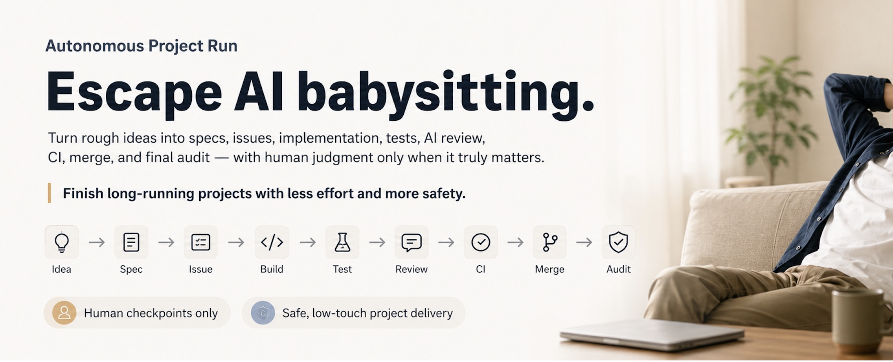

# Autonomous Project Run



Take a multi-ticket GitHub project from an unclear goal to a verified result with minimal supervision.

`autonomous-project-run` coordinates specification, dependency-aware tickets, isolated implementation tasks, tests, AI review, CI, pull requests, merges, issue closure, and a final completeness audit.

> Status: pre-stable (`0.2.0`). Security and release gates are documented in this repository.

[日本語](README.ja.md)

## What it does

- Resumes a project at the earliest incomplete planning or execution stage.
- Asks for human input only when a decision materially changes direction, scope, or irreversible behavior.
- Runs one implementation ticket per fresh task and verifies it before moving forward.
- Stops at explicit safety boundaries such as production changes, credentials, spending, or destructive operations.
- Audits the full project before declaring completion.

## Requirements

- A skills-compatible coding agent
- A GitHub-backed project and authenticated `gh` CLI for the full workflow
- Matt Pocock's workflow skill suite, including `setup-matt-pocock-skills`, `wayfinder`, `to-spec`, `to-tickets`, and `implement`
- Fresh task/thread creation, isolated worktrees, and a recurring heartbeat mechanism for unattended multi-ticket runs
- `codex-autoreview` when the Codex review gate is enabled

Install the upstream workflow skills first:

```sh
npx skills@latest add mattpocock/skills
```

Select the workflow suite when prompted. Its companion skills include `grilling`, `domain-modeling`, `research`, `prototype`, `tdd`, and `code-review`. Run `/setup-matt-pocock-skills` once in each target repository, then install this skill:

```sh
npx skills@latest add AkiGarage/autonomous-project-run
```

Use the official [`mattpocock/skills`](https://github.com/mattpocock/skills) source. In managed environments, review and pin a known-compatible revision when the host supports dependency locks. Without fresh tasks, isolated worktrees, or heartbeat automation, use the workflow as a supervised/manual continuation rather than an unattended run.

## Usage

Invoke the skill with a repository and the outcome you want:

```text
Use $autonomous-project-run to take this project to completion with minimal supervision.
```

The skill authorizes routine repository work such as branches, tests, reviews, commits, pull requests, and merges. It does **not** authorize public publishing, spending, credential access, production mutation, destructive cleanup, force-pushes, or bypassing repository protections.

## Repository layout

```text
skills/autonomous-project-run/
├── SKILL.md
└── agents/openai.yaml
```

## Attribution and license

This project composes and extends workflow concepts from [Matt Pocock's Skills for Real Engineers](https://github.com/mattpocock/skills), including Wayfinder. The upstream project is licensed under the MIT License. With thanks to Matt Pocock for Wayfinder and the composable workflow design.

This repository is independently maintained and is not affiliated with or endorsed by Matt Pocock. See [LICENSE](LICENSE) and [THIRD_PARTY_NOTICES.md](THIRD_PARTY_NOTICES.md).

## Contributing and security

See [CONTRIBUTING.md](CONTRIBUTING.md) for validation and pull-request guidance. Do not put vulnerability details in a public issue; follow [SECURITY.md](SECURITY.md) for private reporting or the detail-free contact fallback.
