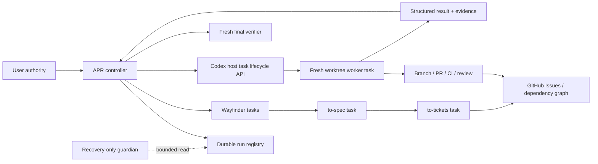

# Architecture

## System view

## Component ownership

| Component | Owns | Must not own |
|---|---|---|
| Controller | intent, routing, dependency frontier, lifecycle transitions, reconciliation, final acceptance | implementation details of every ticket, blind trust in worker output |
| Planning task | exactly one Wayfinder/spec/ticket-planning unit | code mutation by default, implementation scheduling |
| Worker task | exactly one Issue in its assigned branch/worktree | successor creation, other Issues, final project acceptance |
| Host adapter | create/read/archive task actions, project/worktree binding, action result | product decisions, acceptance judgment |
| Host recovery owner | fenced consumption of durable orphan-recovery requests | routine scheduling, implementation, bypassing owner proof |
| Runtime gate | authority/identity/lease/fingerprint/schema enforcement | pretending prose or caller data grants authority |
| Durable registry | reconstructible run/ticket/task/action state | raw transcripts or secrets |
| Guardian | quiet read-only recovery signal | normal scheduling or mutations |
| Final verifier | cross-ticket acceptance from a clean exact commit | repairing work while also declaring final acceptance |

## Sources of truth

Precedence is:

1. current system/developer/user authority;
2. canonical map/spec revision and GitHub Issue graph;
3. git refs, GitHub state, CI/review records, and versioned evidence;
4. durable APR registry;
5. handoff/bootstrap caches;
6. transcript recollection.

A lower source accelerates recovery but cannot override a higher source.

## Context and token strategy

The root controller carries only the current control plane: goal, authority,
dependency frontier, registry summary, fingerprints, decisions, pending effects,
and links to evidence. Large logs, historical transcripts, complete repository
maps, and prior worker reasoning remain external.

Workers receive `fork_turns="none"`-equivalent bounded packets. Results return
conclusions and evidence references, not full exploration. The controller verifies
the cited ranges and complete change inventory instead of repeating broad scans.

Compaction remains a recovery mechanism. It is neither the principal checkpoint
nor the main token-control mechanism. A default model-dependent threshold is
preferred; any override is a measured operational experiment with rollback.

## Global versus repository-local instructions

The always-injected global contract should be short:

- trigger APR for an authorized autonomous multi-ticket run;
- load the APR skill and repository design;
- keep root ownership, safe checkpoints, and evidence gates;
- use native task lifecycle tools through the validated host adapter;
- fail closed on missing capabilities.

All lifecycle schemas, state transitions, examples, and test expectations belong
in this repository and are loaded only for APR work. Shortening global instructions
must not remove the compact operational requirement to execute validated host
actions and acknowledge exactly one successor.

## Deployment boundaries

The public APR skill repository defines portable protocol, validators, schemas,
and tests. Machine-local Codex hooks/adapters are a separate deployment surface.
The repository MUST provide compatibility probes and fixture-driven contracts so
the local adapter can be proven compatible without embedding private paths or
host state in the public source.

Runtime registry instances MUST live outside the tracked repository and public
snapshot surface with restrictive local permissions and bounded/redacted fields.
Only schemas, reducers, fixtures containing synthetic values, and compatibility
tests belong in public source.
