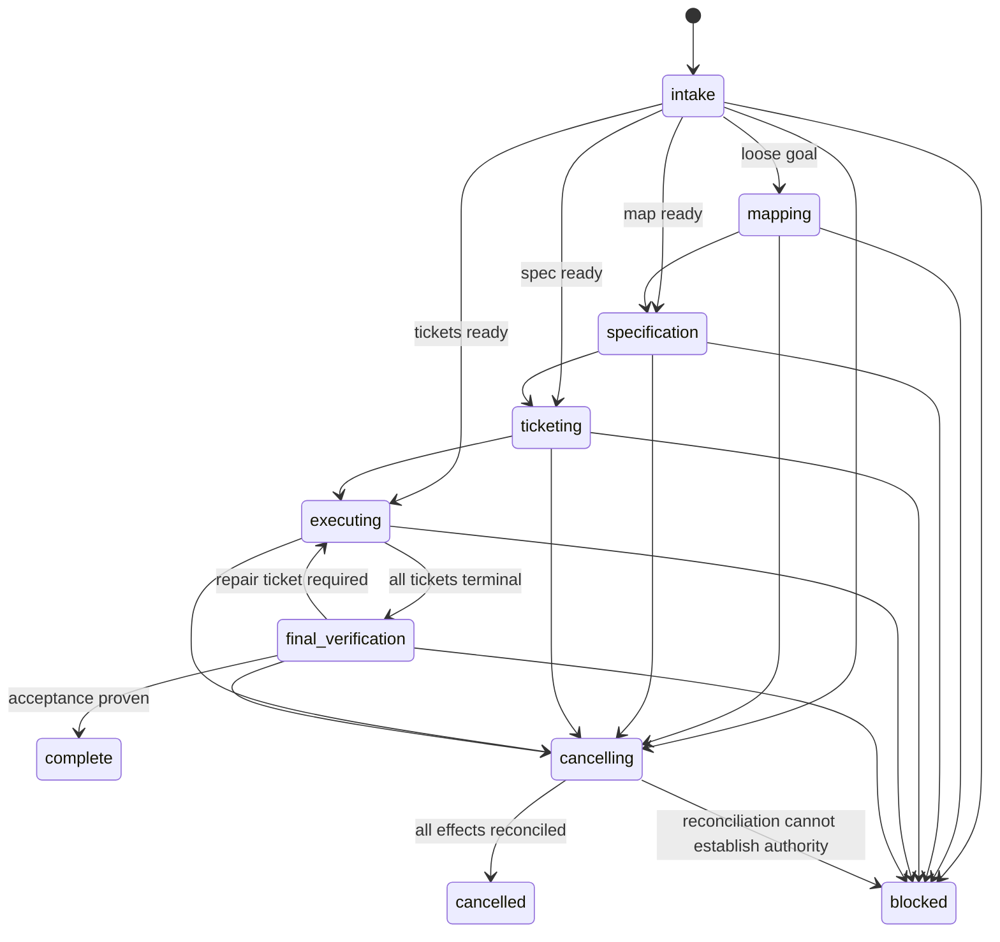

# State machines

## Project run



Entering `cancelling` atomically fences new scheduling and mutation requests.
Only safe local checkpoint/reconciliation actions are allowed until every
in-flight or unknown effect is resolved. Only `complete`, `cancelled`, and
`blocked` are terminal. `blocked` requires a precise
authority/capability/root-cause record and does not mean “work is hard.”

## Planning stage/unit

```text
pending -> create_requested -> task_created -> acknowledged -> running
        -> result_received -> published -> readback_confirmed -> reconciled
```

Each transition is bound to the stage/unit stable request ID and input/output
digest. A restart resumes the lowest non-reconciled transition and reconciles an
unknown create/publish outcome before retry.

## Implementation ticket

```text
ready -> create_requested -> task_created -> claimed -> implementing
      -> checkpointed -> pushed -> pr_open -> checks_green -> reviewed
      -> merged -> issue_closed -> reconciled
```

Additional states:

- `handoff_pending`: same-Issue successor requested; predecessor retains ownership.
- `archive_pending`: implementation is complete; archival needs retry/reconciliation.
- `revision_stale`: canonical map/spec changed; scheduling is stopped for the
  affected closure.
- `cancel_pending`: no new work; in-flight/unknown effects are being reconciled.
- `blocked`: terminal after policy-defined circuit breaker or authority failure.

`archive_pending` is not an implementation failure and MUST NOT create a new
worker. `issue_closed` alone is not sufficient for archival; `reconciled` is.
Execution state and archive state are orthogonal. Final verification waits for all
execution states to be reconciled, not necessarily for every archive retry. A
bounded durable archive backlog may remain and must be reported and owned.

## Controller handoff

```text
active -> checkpoint_prepared -> successor_requested -> successor_created
       -> acknowledgement_pending -> acknowledged -> predecessor_archive_requested
       -> predecessor_archived
```

If task creation has an unknown outcome, reconcile by request ID before retry.
If acknowledgement times out, reconcile ownership and the created task; never
automatically create a second successor. The final controller skips predecessor
archival and remains `active_final` for the user.

## Final verifier

```text
pending -> create_requested -> task_created -> acknowledged -> verifying
        -> verdict_received -> reconciled -> disposed
```

`disposed` records archive or explicit retention independently. Parent closure
requires `reconciled` PASS at the exact canonical spec digest and clean commit;
task creation/result is deduplicated by stable verifier request ID.

## Archive action

```text
eligible -> archive_requested -> archived
                          \-> archive_pending -> archive_requested
```

Eligibility requires a terminal durable result, no unknown side effect, no live
owner dependency, and preserved evidence pointers. Worktree cleanup has its own
separate state machine and authorization.

## Revision drift

On map/spec digest change:

1. atomically mark affected tickets `revision_stale` and fence their old owner
   generations;
2. stop new scheduling for the affected dependency and reverse-dependency closure;
3. reject old-generation push, PR, merge, Issue, task-lifecycle, and other remote
   mutations; allow only bounded local evidence preservation/checkpoint and
   reconciliation needed to establish the outcome of an already-started action;
4. compare old/new acceptance and recompute affected tickets;
5. supersede or amend Issues explicitly;
6. resume with a new revision-bound owner generation and evidence set.
